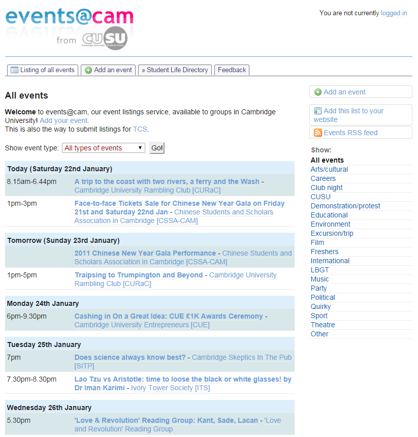

Events portal application
=========================

This is a PHP application which implements an events portal system, enabling individuals, or (in 'organisations' mode, i.e. a directory implementation context), group managers to list events.

Screenshot
----------

Usage
-----

1. Clone the repository.
2. Run `composer install` to install the dependencies.
3. Download and install the famfamfam icon set in /images/icons/
4. Add the Apache directives in httpd.conf (and restart the webserver) as per the example given in .httpd.conf.extract; the example assumes mod_macro but this can be easily removed.
5. Create a copy of the index.html.example file as index.html in the URL directory where the application will run from, and fill in the parameters.
6. Optionally, create a providers implementation (see below).
7. Populate the types table (currently there is no GUI for this).
8. Access the page in a browser at a URL which is served by the webserver.

Providers infrastructure
------------------------

The system, when run in 'organisations' mode, requires a directory implementation ('providers') which acts as a gateway to the organisations that can create events.

_Fuller documentation to follow._

Dependencies
------------

* [FamFamFam Silk Icons set](http://www.famfamfam.com/lab/icons/silk/)
* Optionally, a directory implementation ('providers') - see above

Author
------

Martin Lucas-Smith, CUSU, 2007-14.
Martin Lucas-Smith, Department of Geography, University of Cambridge, 2013-14, 2024.

License
-------

GPL2.
